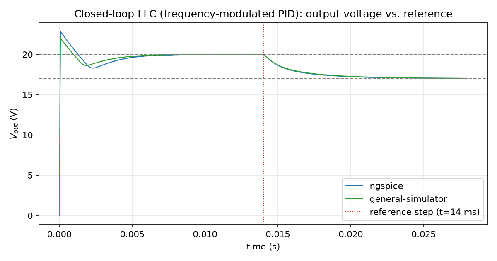

# Boost/LLC resonant converter

## Boost: the same duty-modulated pattern as buck, different topology

A boost converter uses the same [Gate bindings](../gate-bindings.md) PWM-driven pattern as the
[buck chapter](buck.md) — one actively-driven switch, one freewheeling diode, `sum -> pid ->
pwm` if closed-loop — just with the inductor moved to the input side and the diode/switch roles
swapped so the output can exceed `Vin` instead of stepping it down. The
[Validation chapter](../validation.md#open-loop-boost-and-llc-resonant-converters-vs-xyce-and-ngspice)
already has a real cross-simulator comparison for the open-loop case (`Vin = 12 V`, 100 kHz/50%
duty, `L1 = 100 uH`, `C1 = 100 uF`, `R1 = 50 ohm`) — worth reading first if you haven't, since
the rest of this chapter builds on the same half-bridge/PWM machinery for a harder case: a
resonant converter, where duty isn't the control variable at all.

## LLC: why frequency, not duty

An LLC resonant tank's gain curve is a function of *switching frequency* relative to the tank's
own resonant frequency, not of duty cycle the way a hard-switched buck/boost is — a fixed-duty,
frequency-modulated half-bridge drives the tank, and regulation comes from sweeping frequency
near (usually above) resonance, not from varying the pulse width. Concretely, for the tank this
project's own validation experiment uses (`Cr = 22 nF`, `Lr = 100 uH`, `Lm = 400 uH`, `Lpri =
1000 uH`):

$$f_r = \frac{1}{2\pi\sqrt{L_r C_r}} \approx 107\,\text{kHz}$$

That's why the controller chain looks different from a buck/boost's `sum -> pid -> pwm`: the
compensator's output has to become a *frequency* command, not a duty command, and the
gate-driving modulator has to own its own internal oscillator (so a half-bridge's two legs stay
phase-locked at whatever frequency the loop picks) rather than reading a fixed carrier the way
[`kind=pwm`](../component-reference.md#pwm-modulator-1) does. That's exactly what
[`kind=pspwm`](../component-reference.md#pwm-modulator-2-phase-shift-pwm) (Phase-Shift PWM) is
for — see its own Component Reference entry for the full parameter/error list; this chapter
only covers how it's wired into a closed loop.

A real, traced example of the resulting chain (from the internal closed-loop LLC validation
experiment this project's own `general-simulator` cross-validated against ngspice — see the
Validation chapter's closed-loop LLC section):

```text
REF        kind=pwc points=[[0,20],[0.014,17]]
VOUT_PROBE kind=phys2sig node=vout
ERR        kind=sum inputs=REF,VOUT_PROBE signs=1,-1
PID1       kind=pid in=ERR kp=800 ki=4e6 kd=0 n=1000 clamp_lo=-15000 clamp_hi=15000

FNOM       kind=const value=115000
FREQ       kind=sum inputs=FNOM,PID1 signs=1,-1

PHASE0     kind=const value=0
PHASE05    kind=const value=0.5
DUTY048    kind=const value=0.48
MOD1       kind=pspwm f_min=100000 f_max=130000 inputs=FREQ,PHASE0,DUTY048 outputs=MOD1,MOD1_COMP
MOD1_GATE  kind=sig2phys domain=voltage in=MOD1
MOD2       kind=pspwm f_min=100000 f_max=130000 inputs=FREQ,PHASE05,DUTY048 outputs=MOD2,MOD2_COMP
MOD2_GATE  kind=sig2phys domain=voltage in=MOD2
```

The chain is `sum -> pid -> sum -> pspwm` (two `pspwm` instances, one per half-bridge leg) —
`PID1`'s output is subtracted from a nominal center frequency `FNOM` by a second
[`kind=sum`](../component-reference.md#sum) block (`FREQ = FNOM - PID1`, signs `1,-1`) to
produce the actual frequency command, clamped to `[100 kHz, 130 kHz]` by `pspwm`'s own
`f_min`/`f_max`. There's no separate [`kind=gain`](../component-reference.md#gain) or
[`kind=vco`](../component-reference.md#vco-voltage-controlled-oscillator) block in this
particular chain — a plain `sum` is enough to turn a PID's error-correction output into an
offset from a nominal switching frequency, and `pspwm` owns its own oscillator internally
(see its Component Reference entry for why that's deliberate: two instances fed the same
`FREQ` input stay bit-for-bit phase-synchronized without a separately-declared shared
oscillator block). A `kind=gain`/`kind=vco` stage is a legitimate alternative shape for this
same idea (e.g. if the desired mapping from PID output to frequency isn't a plain 1:1 offset)
— it's just not what this particular traced example uses.

## The half-bridge itself

`MOD1`/`MOD2` above are `PHASE0`/`PHASE05` apart — a half period — which is exactly the
complementary-leg pattern [Gate bindings](../gate-bindings.md#a-pwm-driven-gate-half-bridge-pattern)
already covers in full (the `main`/`complement` output convention, why it guarantees no
shoot-through by construction, and how `red=`/`fed=` dead time works) — not repeated here.
The one LLC-specific wrinkle that chapter also covers: `pspwm`'s dead time is converted from
seconds to a phase fraction using *that step's own* resolved frequency, which matters
specifically for a variable-frequency converter like this one (the same absolute dead time eats
a larger fraction of the period at higher frequency, with real ZVS-margin consequences) — a
fixed-frequency `kind=pwm` half-bridge never has to account for that.

## Closed-loop frequency regulation

The same closed-loop LLC run wired above, plotted against ngspice's own independently-run
closed-loop trace of the same circuit (already shown in the
[Validation chapter](../validation.md#closed-loop-llc-frequency-modulated-pid-vs-ngspice-xyce-did-not-complete),
reused here since it's the same run this chapter's netlist excerpt is taken from):



Both simulators settle to their respective setpoints to within about 0.02% of each other (see
the Validation chapter for the exact averaged numbers) despite `general-simulator`'s discrete-time
`kind=pid` block and ngspice's own continuous analog integrator/diode-clamp construction being
different controller *implementations* converging on the same physically correct switching
frequency — not two copies of the same code agreeing with itself.

## Source material

This chapter's netlist fragments and plot are taken from two internal experiments: an
open-loop boost/LLC-vs-Xyce/ngspice benchmark (the same one backing the Validation chapter's
boost/LLC section) and a separate closed-loop, frequency-modulated-PID LLC experiment compared
against ngspice (Xyce did not complete on that specific deck — see the Validation chapter for
why). Neither is linked directly; see the Validation chapter's own citations for what each
compared and found.
