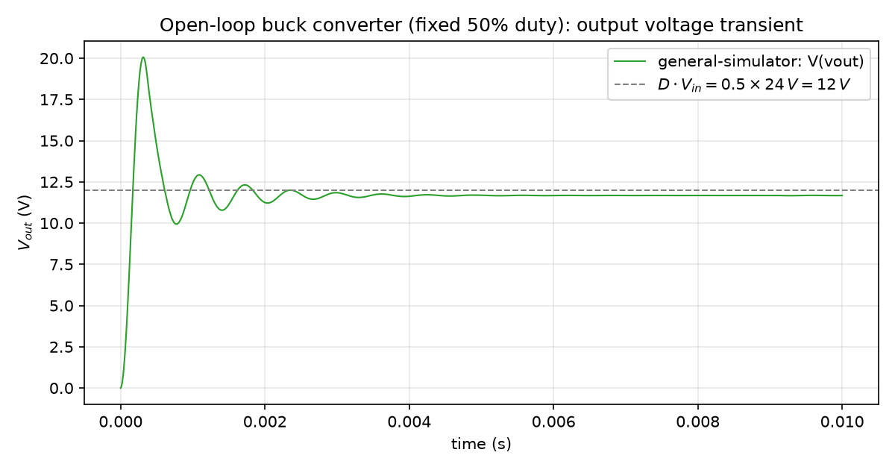
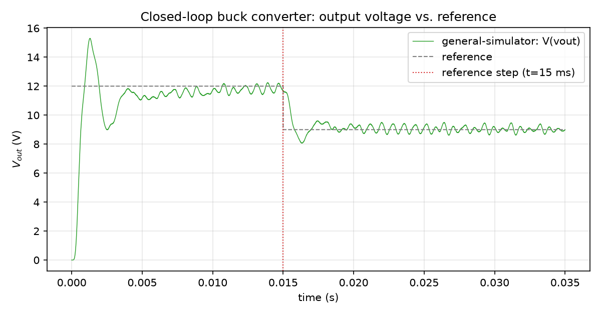

# Buck converter (open-loop and PID)

A buck converter is the simplest place to see `general-simulator`'s PWL/LCP approach and its
block-graph controller layer working together: a hard-switched power stage (an
[`kind=ideal_switch`](../pwl-devices.md#kindideal_switch-on-resistance-plus-body-diode) plus a
freewheeling [`kind=ideal_diode`](../pwl-devices.md#kindideal_diode-the-3-segment-curve)) driven
either by a fixed duty command or by a closed loop built from ordinary
[Component Reference](../component-reference.md) blocks.

## Open-loop buck: topology and `Vout = D * Vin`

The circuit: an input source, a high-side switch, a freewheeling diode, and an `LC` output
filter into a resistive load — exactly the [Gate bindings](../gate-bindings.md) "PWM-driven
gate" pattern, minus the low-side switch (a buck's freewheeling path is a diode, not a second
actively-driven switch):

```text
V1 vin 0 24
D1 vin vx idealswitchmodel
D1 kind=ideal_switch r_on=0.01 g_breakdown=0 v_breakdown=-1e6 g_off=1e-6 v_th=1e6 g_on=0 \
     gate=block ctrl=D1_GATE
D2 0 vx dmodel
D2 kind=ideal_diode g_breakdown=0 v_breakdown=-100 g_off=0 v_th=0.6 g_on=100
L1 vx vout 100u
C1 vout 0 100u
R1 vout 0 5

DUTY   kind=const value=0.5
MOD1   kind=pwm freq=100000 in=DUTY
D1_GATE kind=sig2phys domain=voltage in=MOD1
```

Line by line, against the real component docs: `D1`'s body-diode fields are set so it never
conducts on its own (`v_th=1e6`, an unreachably high threshold — see
[PWL devices](../pwl-devices.md#kindideal_switch-on-resistance-plus-body-diode)), so `D1`
behaves like an ideal MOSFET with no body diode, and `D2` (an ordinary
[`kind=ideal_diode`](../pwl-devices.md#kindideal_diode-the-3-segment-curve)) is the real
freewheeling path. `MOD1` is a fixed-frequency
[PWM Modulator](../component-reference.md#pwm-modulator-1) with a constant 0.5 duty command,
and `D1_GATE` is the mandatory
[`kind=sig2phys domain=voltage`](../component-reference.md#sig2phys-signal-to-physical-converter)
converter every `gate=block ctrl=...` target has to be — see
[Gate bindings](../gate-bindings.md) for why there is no shorter `gate=pwm` spelling anymore.

For an ideal buck in continuous conduction, the averaged relationship is the textbook one:

$$V_{out} = D \cdot V_{in}$$

At `D = 0.5`, `Vin = 24 V`, that's an ideal $12\,\text{V}$. A real run doesn't land exactly
there — switch `r_on` and diode forward drop both eat a little of it — and, for *this*
particular `L1`/`C1`/`R1` combination (`100 uH`/`100 uF`/`5 ohm`), the output filter itself is
underdamped enough to ring visibly before settling (see the "what can go wrong" callout below
for why, and exactly how underdamped):



The steady tail of this run averages to about **11.67 V** — consistent with the
[Validation chapter](../validation.md#open-loop-buck-converter-vs-xyce-and-ngspice)'s own
open-loop buck cross-simulator comparison on the same `Vin`/`L`/`C`/`R`/duty values (ngspice
11.5352 V, Xyce 11.5479 V, `general-simulator` 11.6443 V there), even though that comparison's own
transient traces weren't available to plot directly in this chapter — see this page's plot
credit below.

## Closed-loop buck: `sum -> pid -> pwm` chain

The general pattern for turning the fixed `DUTY` above into a regulated one is three blocks in
series, feeding the same `gate=block ctrl=...` target as before:

```text
REF        kind=pwc points=[[0,12],[0.015,9]]
VOUT_PROBE kind=phys2sig node=vout
ERR        kind=sum inputs=REF,VOUT_PROBE signs=1,-1
PID1       kind=pid in=ERR kp=<Kp> ki=<Ki> kd=<Kd> n=<N> clamp_lo=0 clamp_hi=1
MOD1       kind=pwm freq=100000 in=PID1
D1_GATE    kind=sig2phys domain=voltage in=MOD1
```

— `REF` a [`kind=pwc`](../component-reference.md#piecewise-constant-source-pwc) reference
schedule, `VOUT_PROBE` the mandatory
[`kind=phys2sig`](../component-reference.md#phys2sig-physical-to-signal-converter) reading
`V(vout)` back into the signal domain (the *only* legal way a circuit quantity enters the block
graph), `ERR` an ordinary [`kind=sum`](../component-reference.md#sum) error junction, and `PID1`
the [PID Controller](../component-reference.md#pid-controller) itself — `clamp_lo=0
clamp_hi=1` because its output is a duty fraction, and the PID's own two-sided
conditional-integration anti-windup is what keeps the integrator from running away while duty is
saturated at either rail.

**Why this specific `L1`/`C1`/`R1` needs more than a bare PID.** Deriving the plant's own
natural frequency and damping ratio from the averaged buck model
(`L*dIL/dt = D*Vin - Vout`, `C*dVout/dt = IL - Vout/R`) gives

$$\omega_n = \frac{1}{\sqrt{LC}} = \frac{1}{\sqrt{100\text{e-}6 \times 100\text{e-}6}} = 10{,}000\ \text{rad/s} \approx 1591.5\ \text{Hz}$$

$$\zeta = \frac{1}{2R}\sqrt{\frac{L}{C}} = \frac{1}{10}\sqrt{1} = 0.1 \quad (Q = \tfrac{1}{2\zeta} = 5)$$

— a lightly-damped, resonant plant (the same ringing visible in the open-loop plot above). The
real closed-loop run this section's plot is taken from adds one more block ahead of the PID: a
[`kind=statespace`](../component-reference.md#state-space) low-pass filter (corner
`wc = 1000 rad/s`, about 6x below `wn`) placed *in series*, between `ERR` and the compensator,
specifically to roll off loop gain before the loop ever reaches the plant's own resonance — see
the callout below for why the filter has to sit below `wn` rather than on top of it. With that
filter in place, a filtered-derivative PID (`Kp=0.2, Ki=40, Kd=1e-5, N=20000`, realized as a
[`kind=tf`](../component-reference.md#transfer-function) block over the common-denominator
form `C(s) = Kp + Ki/s + Kd*N*s/(s+N)`) regulates the output cleanly:



Real numbers from that run: peak overshoot on the initial 12V setpoint drops from about 20.0 V
open-loop to about 15.2 V closed-loop, both setpoints settle to within roughly 1.3% of their
reference (11.84 V vs. 12 V; 8.99 V vs. 9 V), and duty never saturates over the whole run
(range 0.0-0.627). A circuit with a less resonant `LC` combination (higher `R`, or a `C`/`L`
ratio giving `zeta` closer to 1) would regulate cleanly with the plain `sum -> pid -> pwm` chain
above and no extra filter block at all — the filter is this specific plant's own requirement,
not a mandatory part of the pattern.

## What can go wrong

Two variants worth knowing about before you design your own closed-loop buck, covered in depth
in this project's internal validation-experiment archive rather than reproduced here:

- **Underdamped output filter, wrong compensator placement.** The filter-corner-placement
  lesson above (roll off loop gain *before* the resonance, not centered on it) was found by a
  first attempt that got it backwards: a low-pass filter centered exactly at the plant's own
  `wn` stacked its own phase lag directly on top of the plant's already-thin phase margin there,
  producing an unconditionally unstable closed loop (confirmed both by closed-loop pole analysis
  and by simulation) rather than a suppressed resonance. Worth reading in full if you're tuning
  a compensator against a genuinely resonant plant — the fix (move the filter's corner well
  below the frequency it's meant to suppress) generalizes beyond this one buck circuit.
- **Hysteresis current-mode control.** An alternative to fixed-frequency PWM entirely: instead
  of `sum -> pid -> pwm`, a [`kind=hysteresis`](../component-reference.md#hysteresis-schmitt-trigger)
  block reads an inductor-current signal directly and switches between two thresholds — no
  fixed switching frequency, no PWM carrier at all, the gate simply follows the hysteresis
  block's own `1.0`/`0.0` output (through the same `sig2phys` converter every gate uses). Useful
  when the specification is a current ripple band rather than a fixed switching frequency;
  the tradeoff is a variable switching frequency that depends on the operating point.

A buck power stage driving a very different kind of load — a small DC motor in cascade, with an
outer speed loop closing back through the same buck's duty cycle rather than regulating `Vout`
directly — is also documented in that same internal archive, as a demonstration that the
block-graph controller layer isn't limited to regulating the circuit quantity that directly
faces the switch.
