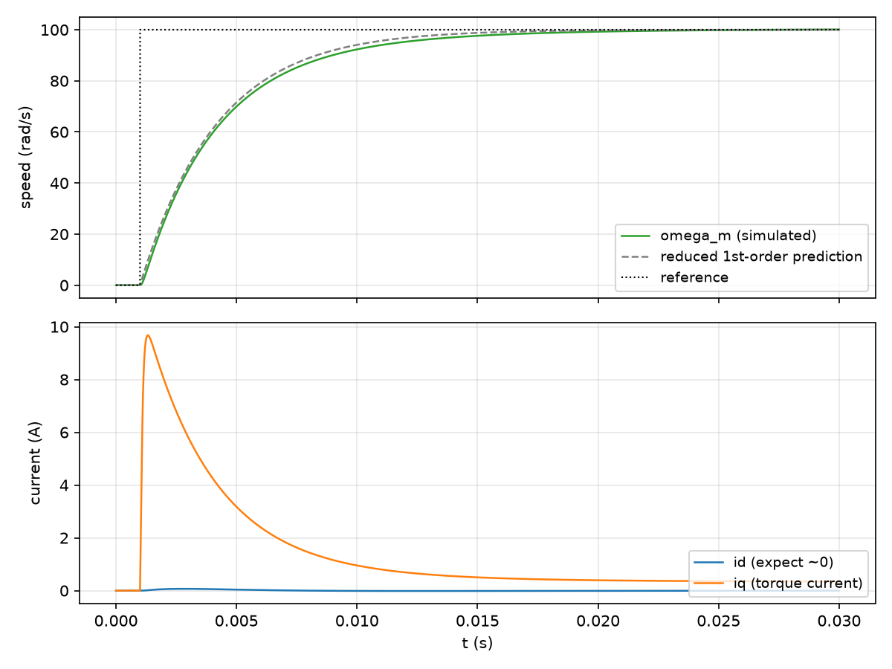

# PMSM field-oriented-control drive

An `id=0` field-oriented-control (FOC) speed loop driving a [`kind=pmsm`](../pmsm.md) block
directly. This is the worked example [The PMSM block](../pmsm.md) points to for real gain
numbers — that chapter's sketch is schematic only, deliberately without a verified gain set.
It's also a clean, minimal illustration of the [`prev:` pattern](../signals.md) in general: both
control loops here close *around the motor block's own previous-step output*, rather than around
a circuit.

## Stage 1: ideal power stage

The `Pmsm` block is driven with `vd`/`vq` voltage commands directly, in the rotor frame it
already expects — no inverter, no `theta`, no Park transform needed here, since `Pmsm`'s inputs
and outputs are already `d`/`q`-frame quantities. This isolates the motor block and the cascade
control design from inverter/PWM/synchronization concerns, which belong to Stage 2 below.

Motor parameters (surface-mount, so `l_d == l_q` and there is no reluctance-torque term):

| Parameter | Value |
|---|---|
| `r_s` | $0.5\ \Omega$ |
| `l_d = l_q` | $3\ \text{mH}$ |
| `lambda_pm` | $0.05\ \text{Wb}$ |
| `pole_pairs` | $4$ |
| `inertia` | $1\times10^{-4}\ \text{kg}\cdot\text{m}^2$ |
| `friction` | $1\times10^{-3}\ \text{N}\cdot\text{m}\cdot\text{s/rad}$ |

The torque constant at `id=0` (no reluctance torque, so all electromagnetic torque comes from
the `lambda_pm`/`iq` interaction):

$$K_{t,\text{eff}} = 1.5\, p\, \lambda_{pm} = 1.5 \times 4 \times 0.05 = 0.3\ \text{N} \cdot \text{m/A}$$

The mechanical time constant of the bare rotor, useful later for judging how far below the
current-loop bandwidth the speed loop should sit:

$$\tau_m = \frac{J}{B} = \frac{1\times10^{-4}}{1\times10^{-3}} = 0.1\ \text{s}$$

### Current-loop gains

The `d`/`q` stator circuit is a first-order `1/(Ls+R)` plant. IMC pole-cancellation places a PI
zero at the plant pole and picks the closed-loop bandwidth directly:

$$K_p = L\,\omega_{c,i}, \qquad K_i = R\,\omega_{c,i}$$

Choosing $\omega_{c,i} = 2\pi \times 2000\ \text{rad/s}$ (a 2 kHz current-loop bandwidth):

$$K_p = 0.003 \times 12566.37 = 37.699, \qquad K_i = 0.5 \times 12566.37 = 6283.19$$

The same gains are used for both the `id` and `iq` current loops, since `l_d = l_q` here.

### Speed-loop gains

Reduce the cascade to a first-order mechanical plant by assuming an ideal (infinitely fast)
inner current loop, so `iq` tracks `iq*` instantaneously:

$$\frac{\omega_m(s)}{i_q^*(s)} = \frac{K_{t,\text{eff}}}{Js + B}$$

For a PI controller $C(s) = K_p + K_i/s$ on a first-order plant $G(s) = K/(Js+B)$,
choosing $K_p/K_i = J/B$ cancels the plant pole and leaves a first-order closed loop with
bandwidth $\omega_c = K_i K / B$. Solving for the gains that hit a target bandwidth
$\omega_{c,s}$:

$$K_i = \frac{\omega_{c,s}\,B}{K_{t,\text{eff}}}, \qquad K_p = \frac{\omega_{c,s}\,J}{K_{t,\text{eff}}}$$

Choosing $\omega_{c,s} = 2\pi \times 50\ \text{rad/s}$ — one decade-plus below the current-loop
bandwidth, so the "ideal inner loop" assumption above is reasonable but not exact (the current
loop's own $\sim 80\ \mu\text{s}$ time constant is about 40x faster than the speed loop's
$\sim 3.2\ \text{ms}$ target, not infinitely faster):

$$K_i = \frac{314.159 \times 1\times10^{-3}}{0.3} = 1.04720, \qquad
K_p = \frac{314.159 \times 1\times10^{-4}}{0.3} = 0.10472$$

This two-step recipe — cancel the current-loop plant pole for the inner gains, then reduce the
cascade to a first-order mechanical plant and cancel *that* pole for the outer gains, keeping the
outer bandwidth safely below the inner one — is the template to reuse for a different motor:
substitute its own `r_s`, `l_d`/`l_q`, `lambda_pm`, `pole_pairs`, `inertia`, `friction` into the
same four formulas.

### Netlist

Both PI loops read the motor's own *previous*-step output via `prev:` — required because `M1`'s
output this step depends on `VD_PI`/`VQ_PI`, which in turn depend on `M1`'s output, so a
same-step reference in either direction would be a genuine algebraic loop (see
[Signals: same-step references and `prev:`](../signals.md)). Routing exactly one edge of each
loop through `prev:` turns it into a legitimate one-sample-delayed sampled-data feedback path,
the same delay a real digital controller reading its own last output already has:

```text
* --- Speed loop: reference steps 0 -> 100 rad/s at t=1ms; error against M1's own previous omega_m ---
SPEEDREF kind=pwc points=[[0,0],[0.001,100]]
SPEED_ERR kind=sum inputs=SPEEDREF,prev:M1_omega_m signs=1,-1
SPEEDPID kind=pid kp=0.10472 ki=1.04720 kd=0 n=1000 clamp_lo=-15 clamp_hi=15 in=SPEED_ERR

* --- Current loops: id*=0 (id=0 control), iq*=SPEEDPID output (torque command) ---
IDREF kind=const value=0
ID_ERR kind=sum inputs=IDREF,prev:M1 signs=1,-1
VD_PI kind=pid kp=37.699 ki=6283.19 kd=0 n=1000 clamp_lo=-200 clamp_hi=200 in=ID_ERR
IQ_ERR kind=sum inputs=SPEEDPID,prev:M1_iq signs=1,-1
VQ_PI kind=pid kp=37.699 ki=6283.19 kd=0 n=1000 clamp_lo=-200 clamp_hi=200 in=IQ_ERR

* --- Load: unloaded throughout this stage ---
TLOAD kind=const value=0

* --- The motor itself. Outputs (default names): M1 (=id, primary), M1_iq, M1_omega_m, M1_theta_e ---
M1 kind=pmsm r_s=0.5 l_d=0.003 l_q=0.003 lambda_pm=0.05 pole_pairs=4 inertia=1e-4 friction=1e-3 \
     inputs=VD_PI,VQ_PI,TLOAD
```

`M1`'s primary output (name `M1`, unqualified) is `id`; the other three outputs default to
`M1_iq`, `M1_omega_m`, `M1_theta_e` per the `Pmsm` block's `outputs=` convention (see
[The PMSM block](../pmsm.md#the-four-outputs)). The speed reference is a `kind=pwc` step from
`0` to `100 rad/s` at `t=1ms`, and the motor is unloaded throughout (`t_load=0`). Run with
`--mode transient --tfinal 0.03 --dt 2e-6`.

### Results

`omega_m` tracks the reference step with a **maximum 2.69 rad/s (2.7%) deviation** from the
reduced first-order prediction

$$\omega_m(t) = 100\left(1 - e^{-\omega_{c,s}(t - t_0)}\right)$$

(the pure first-order response the speed-loop design targets, evaluated from the reference step
at $t_0 = 1\ \text{ms}$) — consistent with the current loop being about 40x faster than the
speed loop rather than infinitely faster, which is exactly the approximation the mechanical-plant
reduction above makes.



Final steady state: $\omega_m = 100.08\ \text{rad/s}$, $i_d = -0.002\ \text{A}$ (effectively
zero, as commanded), $i_q = 0.344\ \text{A}$. As an independent check (not just re-deriving the
same tracking-error number), the motor's own torque balance at steady state with `id=0`,
$T_e = B\,\omega_m + t_{load}$ and $i_{q,ss} = T_e / K_{t,\text{eff}}$, predicts

$$i_{q,ss} = \frac{1\times10^{-3} \times 100.08}{0.3} = 0.3336\ \text{A}$$

which matches the simulated $0.344\ \text{A}$ to within the same few-percent band as the
speed-tracking deviation itself.

## Stage 2: real switching inverter

Not yet built. Stage 2 would replace the direct `vd`/`vq` commands above with a real three-phase
switching inverter, PWM'd from this same cascade, with `vd`/`vq` measured instead from the
inverter's actual switched terminal voltages via a [Clarke/Park transform](../coordinate-transforms.md)
using the motor's own `theta_e` output. That coupling is measurement-only — a continuous block's
output cannot inject current back into a SPICE circuit — the same limitation already documented
for the buck-driven-DC-motor cascade example. Stage 1 above stands on its own as a validation of
the `Pmsm` block and the cascade control design; it does not depend on Stage 2 being built.

## Cross-references

- [Signals: same-step references and `prev:`](../signals.md) — the general mechanism this
  example's two feedback loops both use.
- [The PMSM block](../pmsm.md) — the block's full field reference and the schematic version of
  this same cascade.
- [Coordinate transforms (Clarke/Park) and PLL](../coordinate-transforms.md) — what Stage 2's
  inverter-to-controller measurement chain would use.
- [Component Reference: PMSM](../component-reference.md#pmsm-permanent-magnet-synchronous-motor) —
  full parameter and error listing for `kind=pmsm`.
