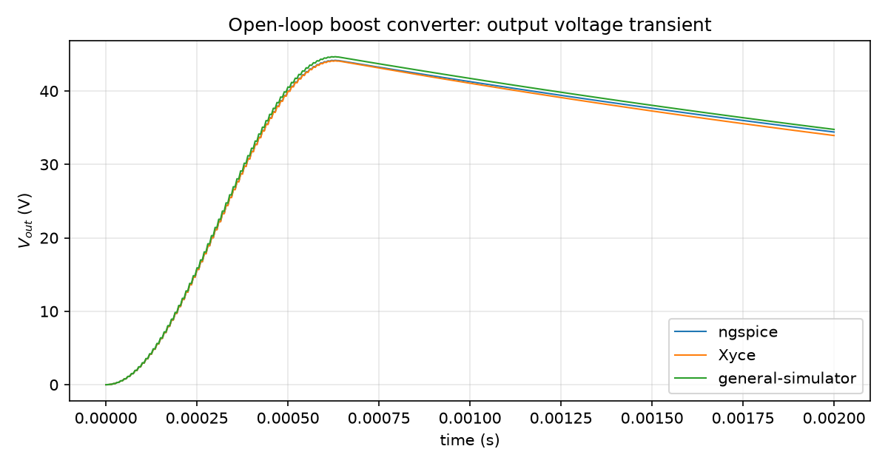
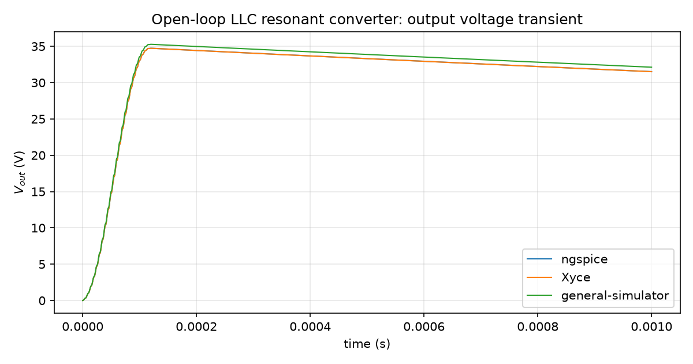

# Validation against ngspice and Xyce

Before you trust a simulator's output enough to build hardware from it, you should be able to
ask "how do you know this is right?" and get a real answer. This chapter is that answer for
`general-simulator`: a summary of cross-simulator comparisons run against ngspice and Xyce —
two independently developed, widely used circuit simulators with a long validation history of
their own — on real converter topologies.

## The standard this chapter holds itself to

The companion **Developer Guide**'s
["Verification discipline"](../dev-guide/verification-discipline.md) chapter states this
project's central rule: numerical agreement alone is not proof. A test that only checks a
result against the same code path that produced it — or against a plausible-looking number
nobody derived separately — cannot catch a bug shared between the implementation and the check.
What *is* strong evidence is agreement between structurally unrelated solvers: ngspice's
tolerant, event-driven Newton-Raphson engine, Xyce's Newton-Raphson-with-voltage-limiting
engine, and `general-simulator`'s Newton-free, LCP-based piecewise-linear device resolution are
three genuinely different numerical methods. When they land close to each other on the same
circuit, that agreement is much harder to fake than a simulator agreeing with its own test
suite — because a bug shared between two unrelated implementations, built independently, is
far less likely than a bug that's merely self-consistent within one of them.

Every number below is taken directly from a real, reproducible comparison recorded in an
internal validation-experiment archive maintained alongside this project (private, not
linked here — see the experiment descriptions in prose below). This chapter names
the comparison tool correctly per case (ngspice or Xyce specifically, never "SPICE" generically)
and reports the metric each experiment actually used — it does not round, estimate, or
manufacture a number that wasn't in the source result. Where the underlying raw transient
data was still available, a plot of the actual traces (not just the summary table) is included
alongside each comparison, generated directly from that data — the plots below are real
renderings, never illustrations.

## Open-loop buck converter, vs. Xyce and ngspice

**Topology**: a hard-switched buck converter, `Vin = 24 V`, `L1 = 100 uH`, `C1 = 100 uF`,
`R1 = 5 ohm`, switching at 100 kHz, 50% duty, open-loop (no feedback).

**What was compared**: the time-weighted (trapezoidal) average of `V(vout)` over the last 0.2 ms
of a 2 ms transient run, computed identically from all three simulators' native output formats.

**Result** (from the `elspice-pwl-buck-vs-xyce-ngspice` experiment):

| Simulator | Method / device models | avg `V(vout)`, t = [1.8 ms, 2 ms] |
|---|---|---|
| ngspice | event-driven tolerant transient engine, `SW`/`D` behavioral models | 11.5352 V |
| Xyce | Newton-Raphson + voltage limiting, `VSWITCH`/exponential `D` model | 11.5479 V |
| `general-simulator` | LCP-resolved PWL devices, no Newton-Raphson | 11.6443 V |

Spread across all three: 0.109 V, or 0.95% of ngspice's value. All three land close to the
textbook ideal $V_{out} = D \cdot V_{in} = 0.5 \times 24\,\text{V} = 12\,\text{V}$, with the
observed 11.5-11.6 V reflecting the expected drop from switch on-resistance and diode forward
conduction losses. This is the simplest case (single topology, no feedback loop to destabilize
comparison), and it establishes the baseline: on a well-defined circuit, three structurally
different nonlinear-solving strategies converge to within about 1% of each other.

The experiment also found an apparent charge-balance anomaly (`avg(I_L1)` not matching
`avg(V_out)/R` within the observed averaging window) — but it showed up identically in *all
three* simulators, and was traced to the deck's own simulated duration being short relative to
the output filter's RC time constant, not a defect in any simulator. Worth mentioning here
precisely because a validation chapter that only reports the numbers that worked out cleanly
isn't trustworthy — this is the kind of caveat that belongs in the record.

*(No transient-waveform plot for this comparison: the source experiment's own convention is to
treat the large `.raw`/`.csd`/CSV traces as mechanically regenerable rather than committing
them, and those regenerated traces were not available at documentation time. The
[open-loop buck example chapter](examples/buck.md) has a real single-simulator plot of the
same topology's transient behavior instead.)*

## Open-loop boost and LLC resonant converters, vs. Xyce and ngspice

**Topology (boost)**: 12 V in, 100 kHz/50% duty PWM, `L1 = 100 uH`, `C1 = 100 uF`,
`R1 = 50 ohm`.

**Topology (LLC)**: 400 V bus, half-bridge, resonant tank `Cr = 22 nF`, `Lr = 100 uH`,
`Lm = 400 uH`, `Lpri = 1000 uH`, with the tank's own resonant frequency
$f_r = \dfrac{1}{2\pi\sqrt{L_r C_r}} \approx 107\,\text{kHz}$, deliberately close to the
100 kHz switching frequency by design.

**What was compared**: instantaneous `V(vout)` at t = 2 ms for the boost case (neither circuit
reaches steady state within the simulated window, confirmed by visual inspection of all three
traces — this is reported as a same-shape transient comparison, not a settled-value one); the
average `V(vout)` over the last 0.1 ms for the LLC case.

**Result** (from the `elspice-pwl-boost-llc-vs-xyce-ngspice` experiment):

Boost, open-loop:

| Simulator | `V(vout)` at t = 2 ms | Peak `V(vout)` |
|---|---|---|
| ngspice | 34.41 V | 44.18 V |
| Xyce | 33.94 V | 44.11 V |
| `general-simulator` | 34.77 V | 44.67 V |

Spread at t = 2 ms: 0.83 V, 2.4% of ngspice's value — larger than the buck case, but all three
simulators trace the same overshoot-to-~44V-then-decay shape, still descending (not settled) at
the comparison point.

LLC, open-loop:

| Simulator | avg `V(vout)`, last 0.1 ms |
|---|---|
| ngspice | 31.69 V |
| Xyce | 31.68 V |
| `general-simulator` | 33.70 V |

ngspice and Xyce agree with each other to within 0.03% here — strong evidence 31.69 V is close
to the "correct" answer for this deck. `general-simulator` is about 6.3% higher (down from an
initial ~8.7% after a dead-time numerical-ringing bug was found and fixed with RC snubbers
matching the reference decks' own topology — documented as a real fix, not a tuned-away
discrepancy). This larger gap is attributed to the PWL diode/switch parameters not being fit to
this specific circuit's operating point, and to a resonant tank operating near its own resonant
frequency being inherently more sensitive to exact device I-V curves than a hard-switched
filter — a real, explicable limitation, not a hidden one. **This is the honest edge of current
validation coverage**: agreement is real but looser on resonant topologies than on
hard-switched ones, and that gap has an identified likely cause (parameter fit) that has not
yet been closed.

## Closed-loop LLC frequency-modulated PID, vs. ngspice (Xyce did not complete)

**Topology**: the same half-bridge LLC resonant tank as above, but closed-loop: a
`sum -> pid -> vco` chain modulating switching *frequency* (not duty) to regulate `V(vout)`
to a reference, including a reference step partway through the run.

**What was compared**: the average `V(vout)` in two windows bracketing two different reference
setpoints, across a 2.8 million fixed-step run for `general-simulator` and an adaptive-step run
for ngspice.

**Result** (from the `elspice-pwl-llc-closed-loop-vs-xyce-ngspice` experiment):

| Simulator | avg `V(vout)` @ [12,14) ms (ref = 20 V) | avg `V(vout)` @ [26,28) ms (ref = 17 V) |
|---|---|---|
| `general-simulator` | 19.999 V | 17.037 V |
| ngspice | 19.999 V | 17.034 V |
| Xyce | did not complete | did not complete |

`general-simulator` and ngspice agree to within 0.02% on both setpoints — both simulators also
show the same qualitative response shape (an overshoot to roughly 22-23 V, a dip, then
convergence).

Xyce's non-completion on this deck is reported honestly rather than omitted: it
is a documented, reproduced Xyce-side limitation with the closed-loop construct used (recorded
as a specific technical finding in the source experiment, not chased further since ngspice
already provides a working, independently-validated reference for the same circuit), not a
`general-simulator` failure being hidden. The two controllers being compared are not
bit-identical implementations — `general-simulator`'s is a discrete-time PID block, ngspice's
closed loop uses a continuous analog integrator/diode-clamp construction — so the 0.02%
agreement is agreement between two different controller *implementations* converging to the
same physically correct operating point, which is a stronger form of evidence than two
identical implementations agreeing with each other.

## What isn't covered yet

Being honest about scope is part of the standard this chapter holds itself to:

- **Dual Active Bridge (DAB) converters.** The internal validation-experiment archive has
  several DAB experiments comparing compiled Verilog-A/XSPICE controller models against
  behavioral models *within* Xyce and *within* ngspice — but none of them run
  `general-simulator` itself on a DAB topology, so there is currently no cross-simulator
  validation data point for DAB in that archive. This is a gap in current coverage, not a
  claim that DAB works or doesn't.
- **Three-phase active front-end / PFC.** An attempt at a real switching three-phase PFC bridge
  closed loop is documented in that internal archive as
  explicitly not yet converged. A follow-up pass (same internal experiment) found and fixed a
  fourth bug — the anti-windup clamp bounded the PID's own output but not the final command
  actually sent to the bridge, letting it sit far outside the bridge's achievable pole voltage —
  using `kind=limit` (see [Component Reference](component-reference.md#waveform-arithmetic-functions-ternary-if-limit))
  to bound the command's own vector magnitude to the actual, time-varying `+-Vdc/2`. That fix is
  real and measured (duty-cycle saturation outside `[0,1]` dropped from 78-84% of the run to
  0.0%, and the DC bus no longer swings negative), but it is a fix for *that specific* bug, not
  for closed-loop convergence: current-loop `iq` still diverges from its commanded `0A` and the
  DC bus still does not track its soft-start ramp. See [the PFC example
  chapter](examples/pfc.md) for the honest current status. It is deliberately excluded from this
  chapter rather than presented as a validation success; it belongs here only once it converges
  and has been checked against ngspice or Xyce.
- **Closed-loop boost PID.** `general-simulator` does achieve sustained, actively-switching
  closed-loop regulation on a boost converter with proper two-sided anti-windup (settling near
  the 24 V reference with duty converging to the theoretical CCM value of
  $D = 1 - V_{in}/V_{ref} = 1 - 12/24 = 0.5$) — on the exact circuit specification where the
  existing Xyce/ngspice baseline experiment's own conclusion states regulation was never
  actually achieved (a one-sided anti-windup bug let the integrator collapse and the converter
  stop switching). That makes it a genuine capability demonstration, but not a cross-simulator
  *validation* in the sense the rest of this chapter uses the word: there is no working
  ngspice/Xyce closed-loop boost trace to compare against.

If you need a topology that isn't listed above, the honest position is that it hasn't been
cross-validated yet — check the Developer Guide's verification-discipline chapter and the
internal validation-experiment archive for the current state, or treat it as an
invitation to run the comparison yourself using `kind=measure` (see
[the measurements chapter](measurements.md)) to extract the same kind of quantitative metric
these comparisons use.
